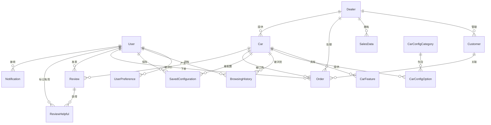
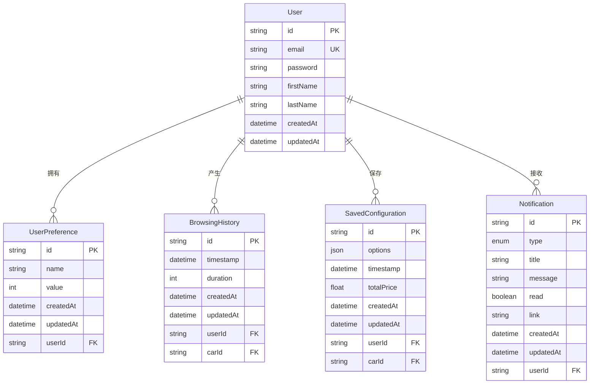
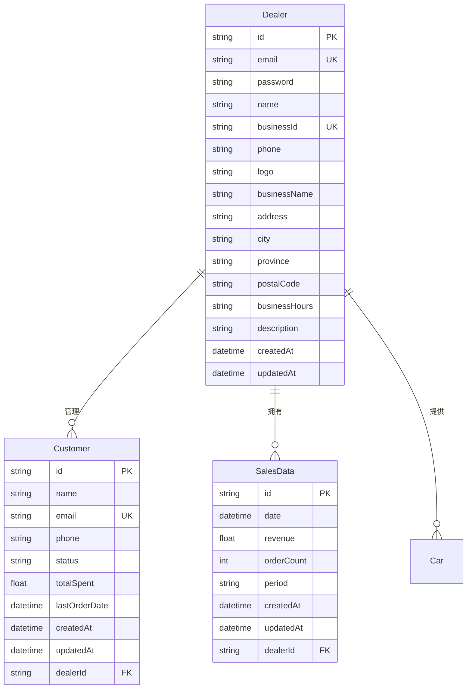
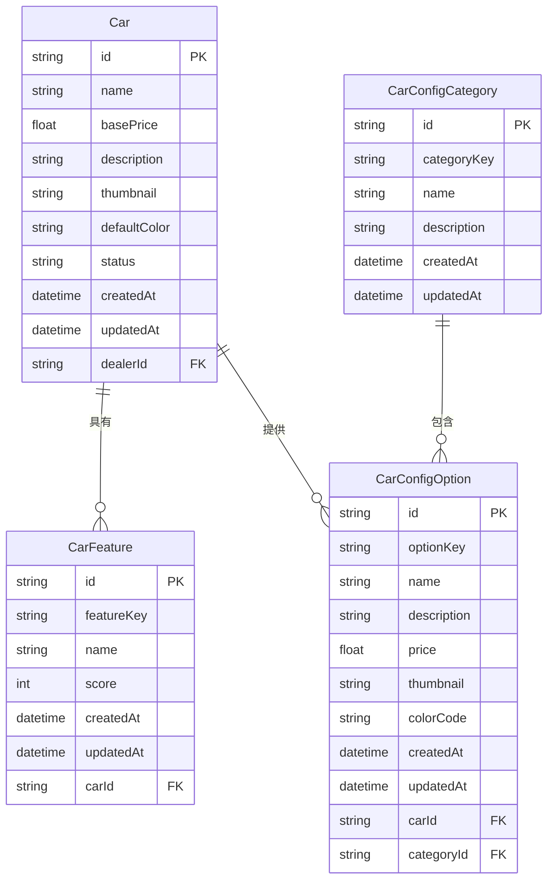
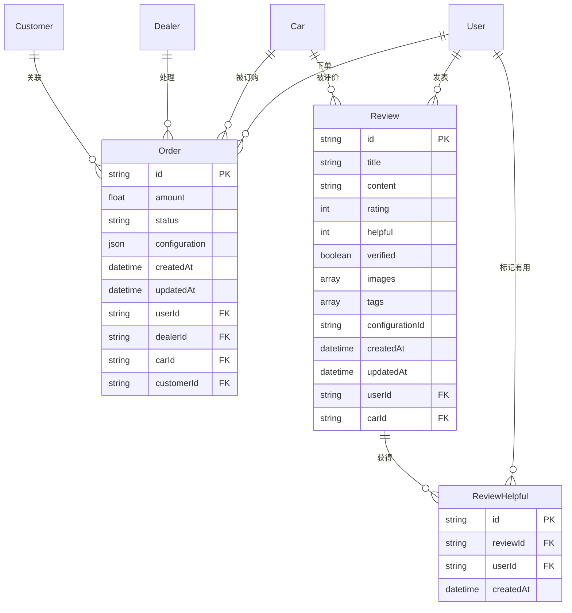

# 汽车3D可视化配置系统 - 完整实体关系图 (ER Diagram)

## 完整系统实体关系图

## 分组实体关系图

### 用户相关实体

### 经销商相关实体

### 车辆相关实体

### 交互相关实体

## 实体属性说明

### User (用户)
- **id**: UUID (主键)
- **email**: String (唯一)
- **password**: String
- **firstName**: String (可选)
- **lastName**: String (可选)
- **createdAt**: DateTime
- **updatedAt**: DateTime

### Dealer (经销商)
- **id**: UUID (主键)
- **email**: String (唯一)
- **password**: String
- **name**: String
- **businessId**: String (唯一)
- **phone**: String (可选)
- **logo**: String (可选)
- **businessName**: String (可选)
- **address**: String (可选)
- **city**: String (可选)
- **province**: String (可选)
- **postalCode**: String (可选)
- **businessHours**: String (可选)
- **description**: String (可选)
- **createdAt**: DateTime
- **updatedAt**: DateTime

### Car (汽车)
- **id**: String (主键)
- **name**: String
- **basePrice**: Float
- **description**: String
- **thumbnail**: String
- **defaultColor**: String
- **status**: String (默认: "active")
- **createdAt**: DateTime
- **updatedAt**: DateTime
- **dealerId**: String (外键, 可选)

### CarConfigCategory (汽车配置类别)
- **id**: UUID (主键)
- **categoryKey**: String
- **name**: String
- **description**: String
- **createdAt**: DateTime
- **updatedAt**: DateTime

### CarConfigOption (汽车配置选项)
- **id**: UUID (主键)
- **optionKey**: String
- **name**: String
- **description**: String
- **price**: Float
- **thumbnail**: String (可选)
- **colorCode**: String (可选)
- **createdAt**: DateTime
- **updatedAt**: DateTime
- **carId**: String (外键)
- **categoryId**: String (外键)

### CarFeature (汽车特性)
- **id**: UUID (主键)
- **featureKey**: String
- **name**: String
- **score**: Int
- **createdAt**: DateTime
- **updatedAt**: DateTime
- **carId**: String (外键)

### SavedConfiguration (保存的配置)
- **id**: UUID (主键)
- **options**: Json
- **timestamp**: DateTime
- **totalPrice**: Float
- **createdAt**: DateTime
- **updatedAt**: DateTime
- **userId**: String (外键)
- **carId**: String (外键)

### Order (订单)
- **id**: UUID (主键)
- **amount**: Float
- **status**: String
- **configuration**: Json
- **createdAt**: DateTime
- **updatedAt**: DateTime
- **userId**: String (外键)
- **dealerId**: String (外键)
- **carId**: String (外键)
- **customerId**: String (外键, 可选)

### Customer (客户)
- **id**: UUID (主键)
- **name**: String
- **email**: String (唯一)
- **phone**: String (可选)
- **status**: String (默认: "active")
- **totalSpent**: Float (默认: 0)
- **lastOrderDate**: DateTime (可选)
- **createdAt**: DateTime
- **updatedAt**: DateTime
- **dealerId**: String (外键)

### SalesData (销售数据)
- **id**: UUID (主键)
- **date**: DateTime
- **revenue**: Float
- **orderCount**: Int
- **period**: String
- **createdAt**: DateTime
- **updatedAt**: DateTime
- **dealerId**: String (外键)

### UserPreference (用户偏好)
- **id**: UUID (主键)
- **name**: String
- **value**: Int
- **createdAt**: DateTime
- **updatedAt**: DateTime
- **userId**: String (外键)

### BrowsingHistory (浏览历史)
- **id**: UUID (主键)
- **timestamp**: DateTime
- **duration**: Int
- **createdAt**: DateTime
- **updatedAt**: DateTime
- **userId**: String (外键)
- **carId**: String (外键)

### Review (评论)
- **id**: UUID (主键)
- **title**: String
- **content**: String
- **rating**: Int
- **helpful**: Int (默认: 0)
- **verified**: Boolean (默认: false)
- **images**: String[]
- **tags**: String[]
- **configurationId**: String (可选)
- **createdAt**: DateTime
- **updatedAt**: DateTime
- **userId**: String (外键)
- **carId**: String (外键)

### ReviewHelpful (评论有用标记)
- **id**: UUID (主键)
- **reviewId**: String (外键)
- **userId**: String (外键)
- **createdAt**: DateTime

### Notification (通知)
- **id**: UUID (主键)
- **type**: NotificationType (枚举)
- **title**: String
- **message**: String
- **read**: Boolean (默认: false)
- **link**: String (可选)
- **createdAt**: DateTime
- **updatedAt**: DateTime
- **userId**: String (外键)

### NotificationType (通知类型枚举)
- SYSTEM
- ORDER
- REVIEW
- PROMOTION