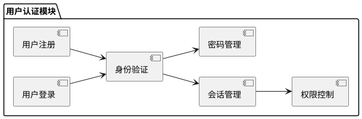
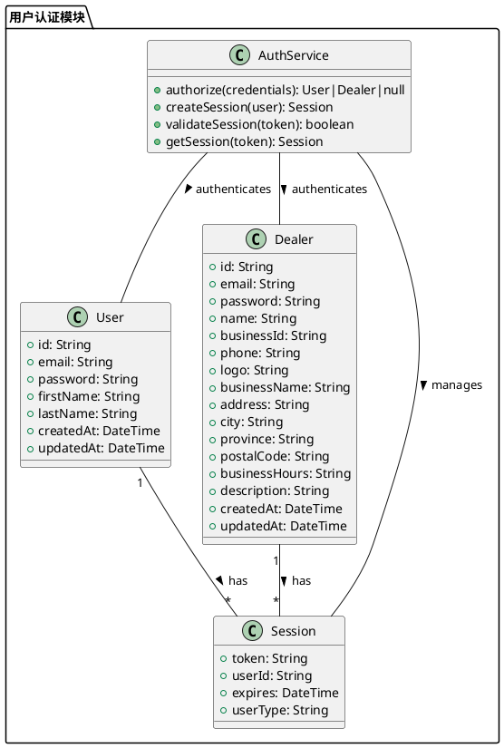
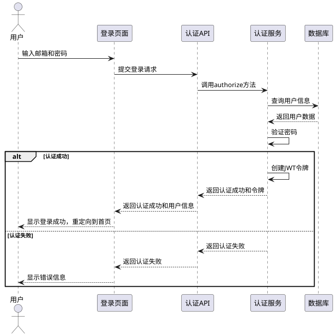
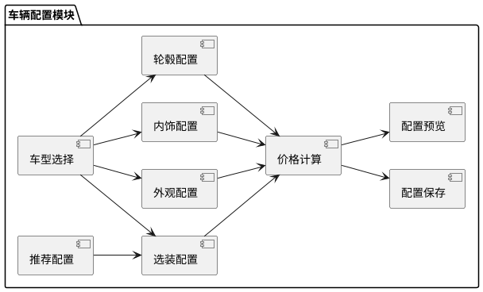
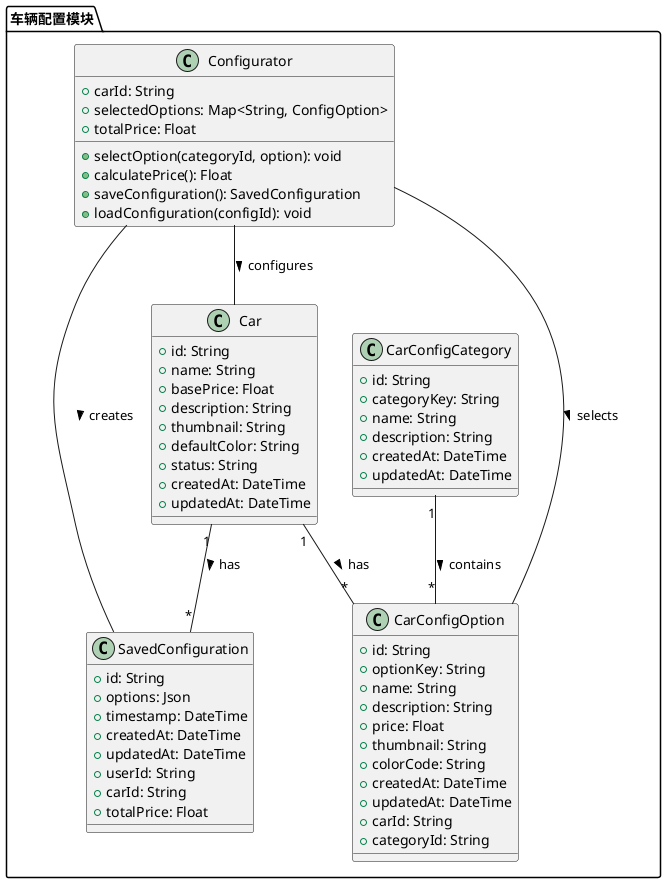
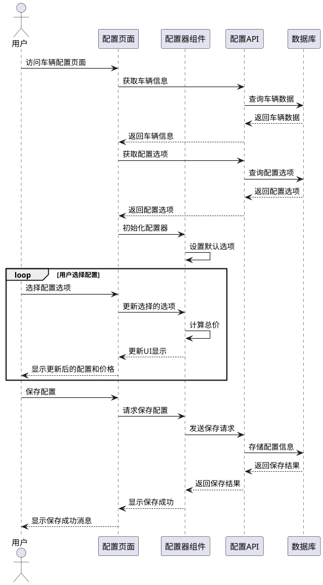
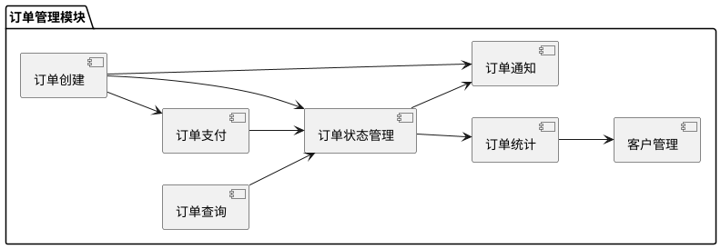
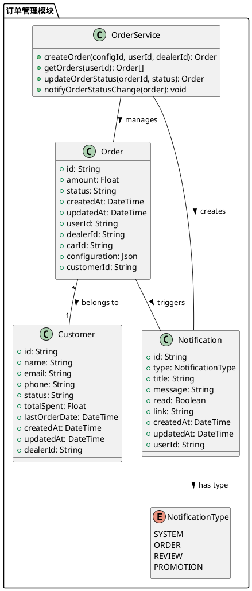
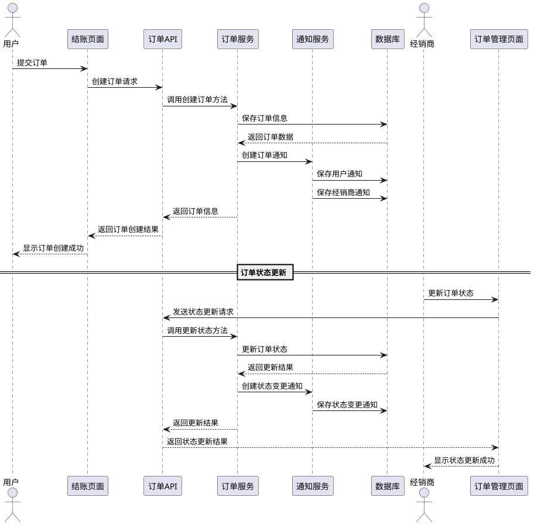

# 项目核心模块 PlantUML 图表

本文档包含项目中三个核心模块（用户认证模块、车辆配置模块和订单管理模块）的 PlantUML 图表，包括功能结构图、类图和时序图。

## 1. 用户认证模块

### 1.1 功能结构图

### 1.2 类图

### 1.3 时序图

## 2. 车辆配置模块

### 2.1 功能结构图

### 2.2 类图

### 2.3 时序图

## 3. 订单管理模块

### 3.1 功能结构图

### 3.2 类图

### 3.3 时序图

