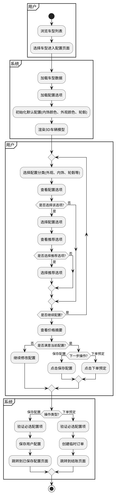
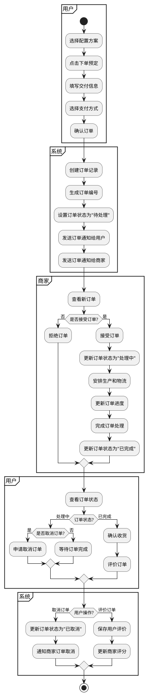

# 汽车3D可视化配置系统活动图 (PlantUML版本)

## 1. 车辆配置功能活动图

```plantuml
@startuml 车辆配置功能活动图

'定义参与者泳道
partition 用户 {
  start
  :浏览车型列表;
  :选择车型进入配置页面;
}

partition 系统 {
  :加载车型数据;
  :加载配置选项;
  :初始化默认配置(内饰颜色、外观颜色、轮毂);
  :渲染3D车辆模型;
}

partition 用户 {
  repeat
    :选择配置分类(外观、内饰、轮毂等);
    :查看配置选项;
    if (是否选择该选项?) then (是)
      :选择配置选项;
      :查看推荐选项;
      if (是否选择推荐选项?) then (是)
        :选择推荐选项;
      else (否)
      endif
    else (否)
    endif
  repeat while (是否继续配置?) is (是)
  
  :查看价格摘要;
  
  if (是否满意当前配置?) then (否)
    :继续修改配置;
  else (是)
    if (下一步操作?) then (保存配置)
      :点击保存配置;
    else (下单预定)
      :点击下单预定;
    endif
  endif
}

partition 系统 {
  if (操作类型?) then (保存配置)
    :验证必选配置项;
    :保存用户配置;
    :跳转到已保存配置页面;
  else (下单预定)
    :验证必选配置项;
    :创建临时订单;
    :跳转到结账页面;
  endif
}

stop

@enduml
```

## 2. 订单处理功能活动图

```plantuml
@startuml 订单处理功能活动图

'定义参与者泳道
partition 用户 {
  start
  :选择配置方案;
  :点击下单预定;
  :填写交付信息;
  :选择支付方式;
  :确认订单;
}

partition 系统 {
  :创建订单记录;
  :生成订单编号;
  :设置订单状态为"待处理";
  :发送订单通知给用户;
  :发送订单通知给商家;
}

partition 商家 {
  :查看新订单;
  if (是否接受订单?) then (否)
    :拒绝订单;
  else (是)
    :接受订单;
    :更新订单状态为"处理中";
    :安排生产和物流;
    :更新订单进度;
    :完成订单处理;
    :更新订单状态为"已完成";
  endif
}

partition 用户 {
  :查看订单状态;
  if (订单状态?) then (处理中)
    if (是否取消订单?) then (是)
      :申请取消订单;
    else (否)
      :等待订单完成;
    endif
  else (已完成)
    :确认收货;
    :评价订单;
  endif
}

partition 系统 {
  if (用户操作?) then (取消订单)
    :更新订单状态为"已取消";
    :通知商家订单取消;
  else (评价订单)
    :保存用户评价;
    :更新商家评分;
  endif
}

stop

@enduml
```