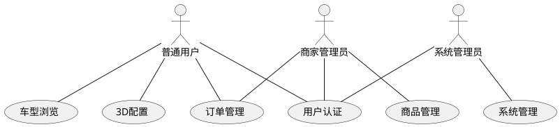
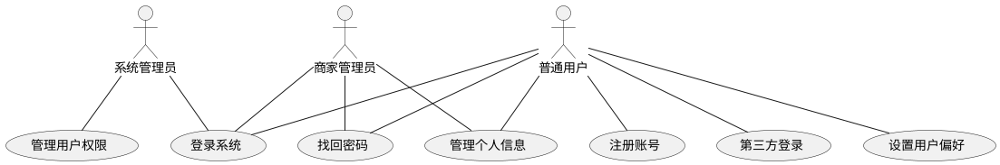
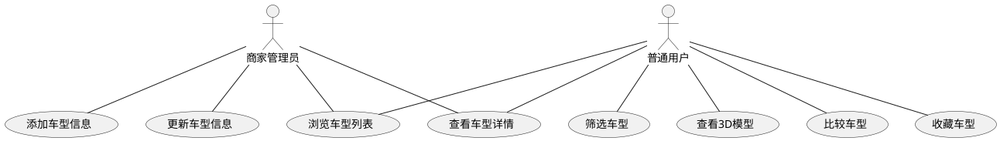
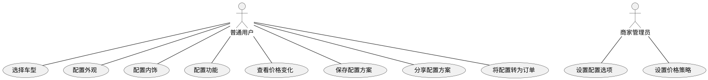
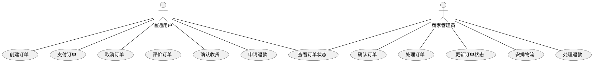
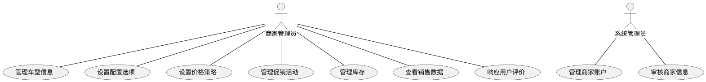
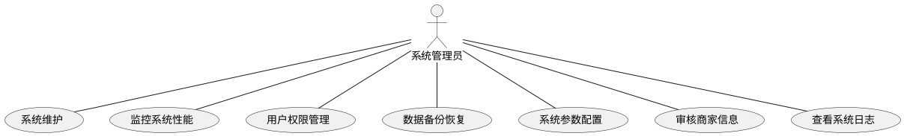

# 汽车3D可视化配置系统用例图 (PlantUML版本)

## 1. 系统总用例图

```plantuml
@startuml 系统总用例图

' 定义参与者
actor "普通用户" as User
actor "商家管理员" as Dealer
actor "系统管理员" as Admin

' 定义用例
usecase "用户认证" as UC1
usecase "车型浏览" as UC2
usecase "3D配置" as UC3
usecase "订单管理" as UC4
usecase "商品管理" as UC5
usecase "系统管理" as UC6

' 关系连接
User -- UC1
Dealer -- UC1
Admin -- UC1

User -- UC2
User -- UC3

User -- UC4
Dealer -- UC4

Dealer -- UC5

Admin -- UC6

@enduml
```

## 2. 用户管理子用例图

```plantuml
@startuml 用户管理子用例图

' 定义参与者
actor "普通用户" as User
actor "商家管理员" as Dealer
actor "系统管理员" as Admin

' 定义用例
usecase "注册账号" as UC1
usecase "登录系统" as UC2
usecase "找回密码" as UC3
usecase "第三方登录" as UC4
usecase "管理个人信息" as UC5
usecase "设置用户偏好" as UC6
usecase "管理用户权限" as UC7

' 关系连接
User -- UC1
User -- UC2
User -- UC3
User -- UC4
User -- UC5
User -- UC6

Dealer -- UC2
Dealer -- UC3
Dealer -- UC5

Admin -- UC2
Admin -- UC7

@enduml
```

## 3. 车型展示子用例图

```plantuml
@startuml 车型展示子用例图

' 定义参与者
actor "普通用户" as User
actor "商家管理员" as Dealer

' 定义用例
usecase "浏览车型列表" as UC1
usecase "筛选车型" as UC2
usecase "查看车型详情" as UC3
usecase "查看3D模型" as UC4
usecase "比较车型" as UC5
usecase "收藏车型" as UC6
usecase "添加车型信息" as UC7
usecase "更新车型信息" as UC8

' 关系连接
User -- UC1
User -- UC2
User -- UC3
User -- UC4
User -- UC5
User -- UC6

Dealer -- UC7
Dealer -- UC8
Dealer -- UC1
Dealer -- UC3

@enduml
```

## 4. 配置定制子用例图

```plantuml
@startuml 配置定制子用例图

' 定义参与者
actor "普通用户" as User
actor "商家管理员" as Dealer

' 定义用例
usecase "选择车型" as UC1
usecase "配置外观" as UC2
usecase "配置内饰" as UC3
usecase "配置功能" as UC4
usecase "查看价格变化" as UC5
usecase "保存配置方案" as UC6
usecase "分享配置方案" as UC7
usecase "将配置转为订单" as UC8
usecase "设置配置选项" as UC9
usecase "设置价格策略" as UC10

' 关系连接
User -- UC1
User -- UC2
User -- UC3
User -- UC4
User -- UC5
User -- UC6
User -- UC7
User -- UC8

Dealer -- UC9
Dealer -- UC10

@enduml
```

## 5. 订单管理子用例图

```plantuml
@startuml 订单管理子用例图

' 定义参与者
actor "普通用户" as User
actor "商家管理员" as Dealer

' 定义用例
usecase "创建订单" as UC1
usecase "支付订单" as UC2
usecase "查看订单状态" as UC3
usecase "取消订单" as UC4
usecase "评价订单" as UC5
usecase "确认收货" as UC6
usecase "申请退款" as UC7
usecase "确认订单" as UC8
usecase "处理订单" as UC9
usecase "更新订单状态" as UC10
usecase "安排物流" as UC11
usecase "处理退款" as UC12

' 关系连接
User -- UC1
User -- UC2
User -- UC3
User -- UC4
User -- UC5
User -- UC6
User -- UC7

Dealer -- UC3
Dealer -- UC8
Dealer -- UC9
Dealer -- UC10
Dealer -- UC11
Dealer -- UC12

@enduml
```

## 6. 商家管理子用例图

```plantuml
@startuml 商家管理子用例图

' 定义参与者
actor "商家管理员" as Dealer
actor "系统管理员" as Admin

' 定义用例
usecase "管理车型信息" as UC1
usecase "设置配置选项" as UC2
usecase "设置价格策略" as UC3
usecase "管理促销活动" as UC4
usecase "管理库存" as UC5
usecase "查看销售数据" as UC6
usecase "响应用户评价" as UC7
usecase "管理商家账户" as UC8
usecase "审核商家信息" as UC9

' 关系连接
Dealer -- UC1
Dealer -- UC2
Dealer -- UC3
Dealer -- UC4
Dealer -- UC5
Dealer -- UC6
Dealer -- UC7

Admin -- UC8
Admin -- UC9

@enduml
```

## 7. 系统管理子用例图

```plantuml
@startuml 系统管理子用例图

' 定义参与者
actor "系统管理员" as Admin

' 定义用例
usecase "系统维护" as UC1
usecase "监控系统性能" as UC2
usecase "用户权限管理" as UC3
usecase "数据备份恢复" as UC4
usecase "系统参数配置" as UC5
usecase "审核商家信息" as UC6
usecase "查看系统日志" as UC7

' 关系连接
Admin -- UC1
Admin -- UC2
Admin -- UC3
Admin -- UC4
Admin -- UC5
Admin -- UC6
Admin -- UC7

@enduml
```